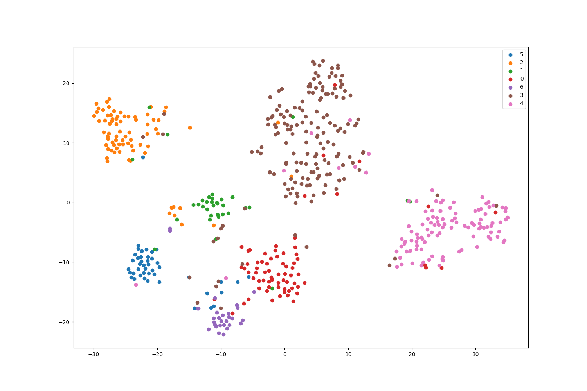
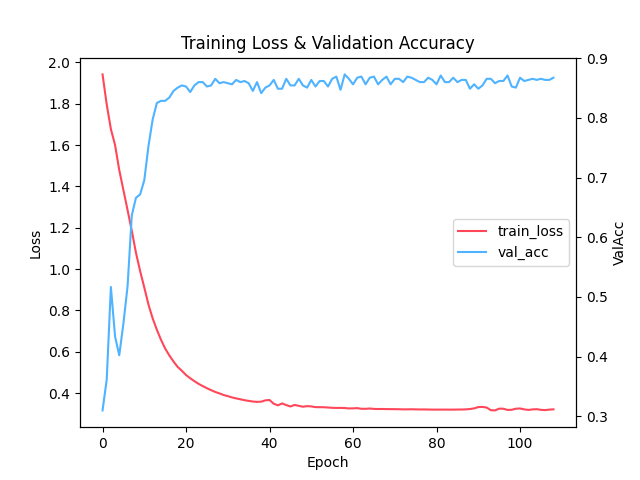

<p align="center">
<h1 align="center">graph-network-models</h1>
</p>


本项目实现了多种图嵌入与图神经网络模型，其中包括 DeepWalk、Node2Vec、GCN、GraphSAGE 以及 GAT。图嵌入模型的实现借助了gensim库，而图神经网络模型的实现则完全依赖于Pytorch框架。

## 🗺️文件结构

部分重要文件夹与文件说明

```shell
-- data		数据集
-- docs		文档
-- src		源码
  |-- gcn	GAT模型代码
    |- data_set.py 	数据处理
    |- model.py		模型
    |- train.py		训练代码
    |- utils.py		工具函数，画散点图和曲线图

  .....

  |- utils.py	工具函数
-- logs		模型训练日志以及保存训练后的模型
-- tools	自定义数据集代码
- requirements.txt	python 依赖文件
```

## 🛠️使用

### 💡实验环境

【1】**Python 3.10**

【2】**安装 `Pytorch`依赖**，`GPU`需要根据 `CUDA`版本安装，下面是常用版本安装命令：

```shell
# torch==2.1.2 CUDA 11.8
pip install torch==2.1.2 torchvision==0.16.2 torchaudio==2.1.2 --index-url https://download.pytorch.org/whl/cu118
# torch==2.1.2 CPU only
pip install torch==2.1.2 torchvision==0.16.2 torchaudio==2.1.2 --index-url https://download.pytorch.org/whl/cpu
```

> 更多Pytorch版本:[Previous PyTorch Versions | PyTorch](https://pytorch.org/get-started/previous-versions/)

【3】**安装其他依赖**，requirements.txt

```shell
pip install -r requirements.txt -i https://pypi.tuna.tsinghua.edu.cn/simple
```

**实验用到的系统硬件环境**

```shell
linux
RTX 3090(24GB显存)， CUDA 11.8
```

### 💡运行

以GCN为例

```shell
python train_gcn.py
```

**可以设置模型参数**

例如GCN模型，运行 `python train_gcn.py -h` 可以显示参数详情：

```shell
--data_path DATA_PATH
                        数据集路径, 如果是cora、citeseer、pubmed,填写名称即可. (default: cora)
  --device DEVICE       默认使用GPU进行训练, cuda or cpu or cuda:0 ... (default: cuda)
  --seed SEED           随机种子. (default: 72)
  --epochs EPOCHS       训练轮数. (default: 200)
  --lr LR               学习率. (default: 0.1)
  --weight_decay WEIGHT_DECAY
                        权重衰减. (default: 0.0005)
  --layers LAYERS       GCN 卷积层数. (default: 2)
  --hidden_dim HIDDEN_DIM
                        隐藏层嵌入维度, 数量是层数减一, 最后一层自动根据数据标签获取. (default: 64)
...
```

使用参数命令示例

```shell
python train_gcn.py --data_path "cora"  --device 'cuda' --layers 2 --hidden_dim 32 --test_model 'best'
```

## 🥦数据集

> 数据来源：[kimiyoung/planetoid](https://github.com/kimiyoung/planetoid)

| Data     | Nodes              | Edges | Classes | Features | e/n  |
| -------- | ------------------ | ----- | ------- | -------- | ---- |
| Citeseer | 3327(15个孤立节点) | 4732  | 6       | 3703     | 1.42 |
| Cora     | 2708               | 5429  | 7       | 1433     | 2.00 |
| Pubmed   | 19717              | 44338 | 3       | 500      | 2.25 |

半监督数据划分

| Data     | train | val | test |
| -------- | ----- | --- | ---- |
| Citeseer | 120   | 500 | 1000 |
| Cora     | 140   | 500 | 1000 |
| Pubmed   | 60    | 500 | 1000 |

全监督数据划分（6:2:2）

| Data     | train | val  | test |
| -------- | ----- | ---- | ---- |
| Citeseer | 1996  | 665  | 665  |
| cora     | 1624  | 542  | 542  |
| Pubmed   | 11830 | 3943 | 3944 |

## ✨实验结果

**半监督（ACC）**

| method    | Citeseer |       | Cora |       | Pubmed |       |
| --------- | -------- | ----- | ---- | ----- | ------ | ----- |
|           | our      | paper | our  | paper | our    | paper |
| DeepWalk  | 44.20    | 43.2  | 67.7 | 67.2  | 66.2   | 65.3  |
| Node2Vec  | 44.6     | -     | 67.6 | -     | 68.60  | -     |
| GCN       | 71.80    | 70.3  | 81.5 | 81.5  | 79.1   | 79.0  |
| GAT       | 71.30    | 72.5  | 82.8 | 83.0  | OOM    | 79.0  |
| GraphSAGE | 66.6     | -     | 76.6 | -     | 74.80  | -     |

> 数据划分是基于[kimiyoung/planetoid](https://github.com/kimiyoung/planetoid)
>
> paper 结果中，DeepWalk 与 GCN 来源于论文：[paper](https://arxiv.org/abs/1609.02907)，GAT来源于论文：[paper](https://arxiv.org/pdf/1710.10903.pdf)
>
> OOM 是由于显存不足而没有结果。
>
> 注意，GAT原始使用的数据集和本项目的数据集不一致，这也是结果和论文有差别的原因之一。

**监督学习，数据按(6:2:2) 划分**

| method    | Citeseer |                                                                | Cora  |       | Pubmed |       |
| --------- | -------- | -------------------------------------------------------------- | ----- | ----- | ------ | ----- |
|           | our      | [paper](https://www.scitepress.org/Papers/2024/123214/123214.pdf) | our   | paper | our    | paper |
| DeepWalk  | 54.05    | -                                                              | 79.52 | -     | 79.59  | -     |
| Node2Vec  | 54.95    | -                                                              | 76.01 | -     | 79.28  | -     |
| GCN       | 76.73    | 76.68                                                          | 88.75 | 87.28 | 86.51  | 87.38 |
| GAT       | 74.47    | 67.20                                                          | 86.16 | 76.70 | OOM    | 83.28 |
| GraphSAGE | 75.23    | 78.24                                                          | 86.53 | 86.58 | 88.06  | 86.85 |

> GCN，GAT，GraphSAGE结果和数据划分方式参考[FAGCN](https://github.com/bdy9527/FAGCN/tree/main)。

> 这些结果仅仅是少量实验的结果，如果有更好的训练参数，欢迎issues分享。

实验命令参数

| 模型      | 文件                   |
| --------- | ---------------------- |
| DeepWalk  | [链接](docs/deepwalk.md)  |
| Node2Vec  | [链接](docs/node2vec.md)  |
| GCN       | [链接](docs/gcn.md)       |
| GAT       | [链接](docs/gat.md)       |
| GraphSAGE | [链接](docs/graphsage.md) |

监督学习gcn `cora` 数据集的散点图和曲线图结果（acc=88.75）





## 🔮 自定义数据集

DeepWalk、Node2Vec、GCN、GAT 模型数据集格式参考：[tools/build_dataset1.py](tools/build_dataset1.py)

运行示例

```shell
# 创建数据集保存到test.pkl文件
cd tools
python build_dataset1.py
# 运行
cd ..
python train_gcn.py --data_path "xxx/test.pkl"  --device 'cuda' --layers 1 --hidden_dim 16 --test_model 'best' --is_draw 'False'
```

GraphSAGE 模型数据集格式参考：[tools/build_dataset2.py](tools/build_dataset2.py)

运行示例

```shell
python train_graphsage.py --data_path "xxx/test2.pkl"  --device 'cuda' --batch_size 2 --hidden_dim 16 --k 1 --num_sample 4 --dropout 0.6 --agg "mean" --concat "False" --activation "True" --bias "True" --test_model "best" --is_draw 'False'
```

> 运行示例记得更换数据集路径 `--data_path`（使用绝对路径）。
> 本项目模拟的数据过少，会出现无法画散点图的情况，因此设置 `--is_draw` 为False，如果想画图就删除这个参数或设置为 `'True'`。

## 参考

- [PetarV-/GAT（original，tensorflow）](https://github.com/PetarV-/GAT)
- [tkipf/gcn（original，tensorflow）](https://github.com/tkipf/gcn)
- [FighterLYL/GraphNeuralNetwork](https://github.com/FighterLYL/GraphNeuralNetwork)
- [Diego999/pyGAT](https://github.com/Diego999/pyGAT)
- [dmlc/dgl](https://github.com/dmlc/dgl)
- [graph/DeepWalk_and_Node2Vec.ipynb](https://gitee.com/dogecheng/python/blob/master/graph/DeepWalk_and_Node2Vec.ipynb)
- [shenweichen/GraphEmbedding](https://github.com/shenweichen/GraphEmbedding)
- [dedekinds/Graph-Embedding](https://github.com/dedekinds/Graph-Embedding/tree/master)
- [williamleif/GraphSAGE（original，tensorflow）](https://github.com/williamleif/GraphSAGE/tree/master)
- [williamleif/graphsage-simple（original，Pytorch）](https://github.com/williamleif/graphsage-simple)
- [twjiang/graphSAGE-pytorch](https://github.com/twjiang/graphSAGE-pytorch/tree/master/src)
- [bdy9527/FAGCN (github.com)](https://github.com/bdy9527/FAGCN)
- [【Code】GraphSAGE 源码解析 - 阿泽的文章 - 知乎](https://zhuanlan.zhihu.com/p/142205899)
- [Cora (60%/20%/20% random splits) Benchmark (Node Classification) | Papers With Code](https://paperswithcode.com/sota/node-classification-on-cora-60-20-20-random)
- [CiteSeer (60%/20%/20% random splits) Benchmark (Node Classification) | Papers With Code](https://paperswithcode.com/sota/node-classification-on-citeseer-60-20-20)
- [PubMed (60%/20%/20% random splits) Benchmark (Node Classification) | Papers With Code](https://paperswithcode.com/sota/node-classification-on-pubmed-60-20-20-random)
